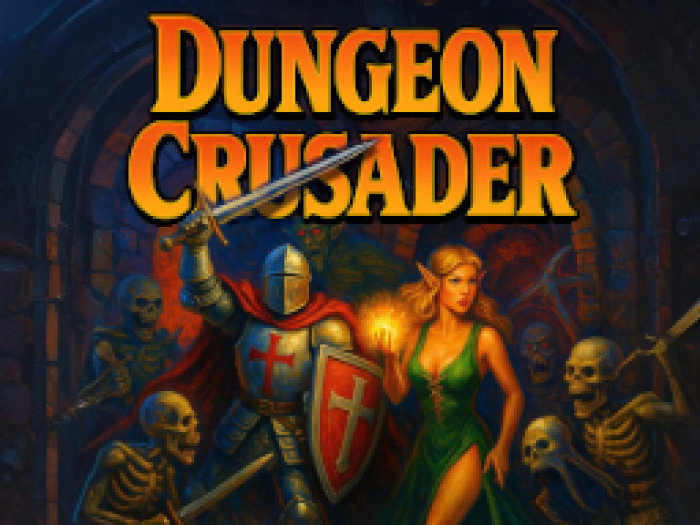

<p align="center">
    
</p>


## Download

A preview version for Windows x64 can be found under [Releases](https://github.com/christian-post/cpp-game-test/releases). JUst download and unpack the .zip folder, and start "GameText.exe" found in "Releases".


## Building from source

### Windows x64 (Visual Studio Only)

1. Install [Visual Studio](https://visualstudio.microsoft.com/) (select the "Desktop development with C++" workload).
2. Open Cmd/Powershell and clone this repository:
   ```bash
   git clone https://github.com/christian-post/cpp-game-test.git
   ```
   Alternatively, if you don't have Git installed, [download the repo as ZIP](https://github.com/christian-post/cpp-game-test/archive/refs/heads/master.zip) and unpack it.
3. Open the folder in Visual Studio or double-click on the .sln file.
4. Visual Studio will detect the CMake project automatically.
5. Set the build configuration to `x64-Debug`.
6. Build the project with `Ctrl+Shift+B`.
7. Run the program with F5.

---

### Windows x64 (CMake)

1. Install [CMake](https://cmake.org/download/) and [Visual Studio Build Tools](https://visualstudio.microsoft.com/visual-cpp-build-tools/). Make sure to select "Visual C++ tools for CMake".
2. Clone this repository:

   ```bash
   git clone https://github.com/christian-post/cpp-game-test.git
   cd cpp-game-test
   ```

3. Create a build directory and compile:

   ```bash
   mkdir build
   cd build
   cmake ..
   cmake --build .
   ```

4. Run the game:

   ```bash
   ./Debug/MyGame.exe
   ```

> **Note:**
> Make sure the build configuration is `Debug`.

---

### Linux (CMake CLI)

1. Install required packages:

   ```bash
   sudo apt update
   sudo apt install git build-essential cmake libasound2-dev mesa-common-dev libx11-dev libxrandr-dev libxi-dev xorg-dev libgl1-mesa-dev libglu1-mesa-dev
   ```

2. Clone and build raylib:

   ```bash
   git clone https://github.com/raysan5/raylib.git
   cd raylib
   mkdir build
   cd build
   cmake -DPLATFORM=Desktop ..
   make
   sudo make install
   ```

3. Clone this repository:

   ```bash
   git clone https://github.com/christian-post/cpp-game-test.git
   cd cpp-game-test
   ```

4. Create a build directory and compile:

   ```bash
   mkdir build
   cd build
   cmake ..
   make
   ```

5. Run the game:

   ```bash
   ./MyGame
   ```

---


## Playing the Game

### Controls

You can use the keyboard or a gamepad (I tested with an XBOX Controller). 
Here is the default button layout: 

| Action        | Keyboard Keys    | Xbox Controller Button          | Function                    |
|---------------|------------------|---------------------------------|---------------------------- |
| Move Up       | ↑ or W           | Left Stick Up or D-Pad Up       | move player/cursor          |
| Move Down     | ↓ or S           | Left Stick Down or D-Pad Down   | move player/cursor          |
| Move Left     | ← or A           | Left Stick Left or D-Pad Left   | move player/cursor          |
| Move Right    | → or D           | Left Stick Right or D-Pad Right | move player/cursor          |
| Action 1      | O                | A					             | select item<br>advance text |
| Action 2      | P                | Y								 | use weapon                  |
| Action 3      | K                | X								 | ---                         |
| Action 4      | L                | B								 | ---                         |
| Confirm       | Enter            | Start							 | open/close inventory        |
| Cancel        | Backspace        | Back							 | ---                         |
| Debug Mode    | F1               | —                               | debug overlay               |
| Restart Game  | F5               | —                               | restart and go back to title|


---

## Some Notes on the Software Design

### The Game object
Game is the overarching data structure that is responsible for the game loop as well as high-level operations above the individual game scenes and objects.
It manages scenes, events, assets, and the main render texture that the scenes can draw to. The game loop consists of update, and draw. The update method is for the game logic, and most high-level game objects have an update method as well, that gets called here. The deltaTime between frames is passed to all of them to ensure framerate-independency. In draw, the scenes draw to the main render texture.

### Scenes
A scene can encapsulate/abstract any part of the game. Currently, I'm using the following scenes:

#### Preload
This scene runs before all others, and is responsible for loading all assets (external data) that are being used later. Currently I am loading everything up front, because it's not much. I might have to think about loading/streaming additional data later, but the game isn't nearly as big for this to be necessary.
Once the loading is done, this scene stops and calls the TitleSceen.
TODO: I'm planning to make a loading bar animation that runs parallel to the data streaming, but I'll probably need parallelism (std::thread) for this...

#### TitleScreen
Nothing to see here, really. Just press any key to advance.
Known bugs: The button you press here gets also registered in the next scene (InGame), but I'm not sure why.

#### InGame
This is the most important scene (shocking, I know). It handles updating and displaying of the (visible and invisible) game objects. Most of these are instances of the Sprite class, more on that later.

