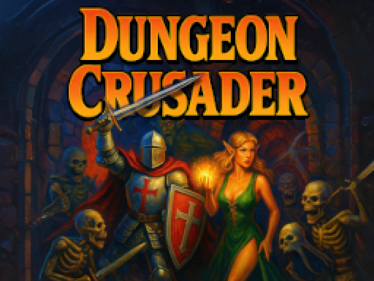
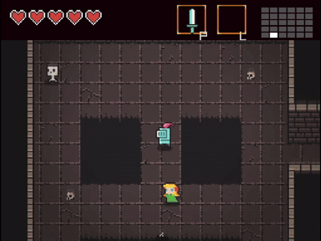

<p align="center">
    
</p>



## Download

A preview version for Windows x64 can be found under [Releases](https://github.com/christian-post/cpp-game-test/releases). Just download and unpack the .zip folder, and start "GameText.exe" found in "Release".


## Building from source

### Windows x64 (Visual Studio Only)

1. Install [Visual Studio](https://visualstudio.microsoft.com/) (select the "Desktop development with C++" workload).
2. Open Cmd/Powershell and clone this repository:
   ```bash
   git clone https://github.com/christian-post/cpp-game-test.git
   ```
   Alternatively, if you don't have Git installed, [download the repo as ZIP](https://github.com/christian-post/cpp-game-test/archive/refs/heads/master.zip) and unpack it.
3. Open the folder in Visual Studio or double-click the .sln file.
4. Set the build configuration to `x64-Debug`.
5. Build the project with `Ctrl+Shift+B`.
6. Run the program with F5.

---

### Windows x64 (CMake)

1. Install [CMake](https://cmake.org/download/) and [Visual Studio Build Tools](https://visualstudio.microsoft.com/visual-cpp-build-tools/). Make sure to select "Visual C++ tools for CMake".
2. Clone this repository:

   ```bash
   git clone https://github.com/christian-post/cpp-game-test.git
   cd cpp-game-test
   ```

3. Create a build directory and compile:

   ```bash
   mkdir build
   cd build
   cmake ..
   cmake --build .
   ```

4. Run the game:

   ```bash
   ./Debug/MyGame.exe
   ```

> **Note:**
> Make sure the build configuration is `Debug`.

---

### Linux (CMake CLI)

1. Install required packages:

   ```bash
   sudo apt update
   sudo apt install git build-essential cmake libasound2-dev mesa-common-dev libx11-dev libxrandr-dev libxi-dev xorg-dev libgl1-mesa-dev libglu1-mesa-dev
   ```

2. Clone and build raylib:

   ```bash
   git clone https://github.com/raysan5/raylib.git
   cd raylib
   mkdir build
   cd build
   cmake -DPLATFORM=Desktop ..
   make
   sudo make install
   ```

3. Clone this repository:

   ```bash
   git clone https://github.com/christian-post/cpp-game-test.git
   cd cpp-game-test
   ```

4. Create a build directory and compile:

   ```bash
   mkdir build
   cd build
   cmake ..
   make
   ```

5. Run the game:

   ```bash
   ./MyGame
   ```

---


## Playing the Game

### Controls

You can use the keyboard or a gamepad (I tested with an XBOX Controller). 
Here is the default button layout: 

| Action             | Keyboard Keys    | Xbox Controller Button          | Function                        |
|--------------------|------------------|---------------------------------|---------------------------------|
| Move Up            | ↑ or W           | D-Pad Up                        | move player/menu cursor         |
| Move Down          | ↓ or S           | D-Pad Down                      | move player/menu cursor         |
| Move Left          | ← or A           | D-Pad Left                      | move player/menu cursor         |
| Move Right         | → or D           | D-Pad Right                     | move player/menu cursor         |
| Action 1           | O                | A	                              | select item<br>advance text     |
| Action 2           | P                | Y	                              | use weapon 2                    |
| Action 3           | K                | X                               | use weapon 1                    |
| Action 4           | L                | B	                              | unused                          |
| Confirm            | Enter            | Start                           | open/close inventory            |
| Cancel             | Backspace        | Back                            | game menu                       |
| Toggle Fullscreen  | F4               | —                               | switches to fullscreen and back |
| Restart Game       | F5               | —                               | restart and go back to title    |
|                    |                  |                                 |                                 |

Debug Functions (won't be in the final game) - only available in debug mode 

| Action        | Keyboard Keys    | Xbox Controller Button          | Function                    |
|---------------|------------------|---------------------------------|---------------------------- |
| Debug Mode    | F1               | —                               | toggle debug overlay        |
| Debug Menu    | F2               | —                               | open debug menu             |
| Debug 1       | Keypad 1         | —                               | teleport to next room       |
| Debug 2       | Keypad 2         | —                               | Toggle sound on/off         |
| Debug 3       | Keypad 3         | —                               | activate god mode           |


---


## Credits (see LICENSE for detailed licensing info)

[raylib](https://www.raylib.com/) Copyright (c) 2013-2025 Ramon Santamaria (@raysan5)</br>
[JSON for Modern C++](https://github.com/nlohmann/json/) Copyright (c) 2013-2025 Niels Lohmann

16x16 DungeonTileset II by [0x72](https://0x72.itch.io/dungeontileset-ii)</br>
Fantasy RPG Characters by [superdark](https://superdark.itch.io/16x16-free-npc-pack)</br>
Classic RPG Tileset by [Jestan](https://jestan.itch.io/classic-rpg)</br>
Roguelike/RPG Items by [@JoeCreates}(https://opengameart.org/content/roguelikerpg-items)</br>
"Dubious Dungeon" by [Bogart VGM](https://opengameart.org/content/dubious-dungeon)</br>
"Dungeon 02" by [Fantasy Music](https://opengameart.org/content/dungeon-02)</br>
"title screen" by [frenchyboy](https://opengameart.org/content/title-screen)</br>
"No Hope (You died)" by [CleytonKauffman](https://opengameart.org/users/cleytonkauffman)</br>
"8bit adventure" by [CodeManu](https://opengameart.org/content/8bit-adventure)</br>
"50 RPG sound effects" by [Kenney](https://opengameart.org/content/50-rpg-sound-effects)</br>
"80 CC0 RPG SFX" by [rubberduck](https://opengameart.org/content/80-cc0-rpg-sfx)</br>
"Level up, power up, Coin get (13 Sounds)" by [wobblebox](https://opengameart.org/content/level-up-power-up-coin-get-13-sounds)</br>
"XBOX UI Prompt Pack" by [actuallyKron](https://actuallykron.itch.io/xbox-ui-prompts)</br>
"top-down-dungeon-tileset" by [Buch](https://opengameart.org/users/buch), sponsored by Abram Connelly